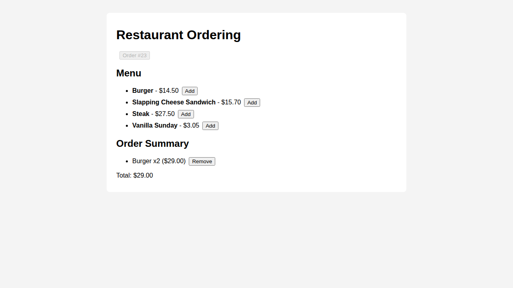

# Restaurant Ordering System

[](https://github.com/Emms434/Restaurant-Ordering-System/actions/workflows/ci.yml)

A full-stack restaurant ordering app: customers browse a menu, start an order,
add and remove dishes, and see a running total. It has a Spring Boot REST API,
a PostgreSQL database with versioned migrations, and a React frontend, all
runnable locally with one Docker Compose command.



## Tech stack

| Layer | Technology |
|---|---|
| Backend | Java 17, Spring Boot 3 (Web, Data JPA, Validation) |
| Database | PostgreSQL 16, Flyway migrations |
| Frontend | React 18, Vite |
| Testing | JUnit 5, Mockito, MockMvc, integration tests against real Postgres |
| DevOps | Docker Compose, GitHub Actions (CI), AWS (Elastic Beanstalk, S3, CloudFront, RDS) |

## How it works

```text
React (Vite)  --HTTP/JSON-->  OrderingController  -->  OrderingService  -->  JPA repositories  -->  PostgreSQL
                                     |                        |
                           ApiExceptionHandler        business rules: quantities,
                           (errors -> JSON 404/400)   line totals, order total
```

- **Controller** (`controller/`) maps URLs to service calls and validates request bodies.
- **Service** (`service/OrderingService`) holds the business logic. Adding an item
  already on the order bumps its quantity, and removing the last unit deletes the line.
  Totals are computed with `BigDecimal` so money stays exact.
- **Entities** (`model/`) map to three tables: `menu_items`, `customer_orders`, `order_lines`.
- **Flyway** (`resources/db/migration`) creates and seeds the schema on startup.
  Hibernate only *validates* the schema and never changes it.
- **DTOs** (`dto/`) define the JSON the API returns, kept separate from the entities.

## API

Base URL: `http://localhost:8080/api`

| Method | Path | Body | Result |
|---|---|---|---|
| `GET` | `/menu` | – | All menu items, sorted by name |
| `POST` | `/orders` | – | `201` new empty order |
| `GET` | `/orders/{id}` | – | Order with lines and total |
| `POST` | `/orders/{id}/items` | `{"itemName": "Burger"}` | Adds one; returns updated order |
| `DELETE` | `/orders/{id}/items` | `{"itemName": "Burger"}` | Removes one; returns updated order |

Item names are case-insensitive. Unknown orders or items return `404` with
`{"error": "..."}`, and a blank `itemName` returns `400`. `GET /health` returns `OK`.

## Running locally

### With Docker (recommended)

```bash
docker compose up --build
```

- Frontend: <http://localhost:5173>
- Backend: <http://localhost:8080>
- Postgres: `localhost:5432` (db/user/password: `restaurant`)

Stop with `docker compose down` (add `-v` to also wipe the database).

### Without Docker

Requires Java 17+, Maven 3.9+, Node 18+, and a local PostgreSQL with a
`restaurant` database and user (password `restaurant`).

```bash
# Backend
cd ordering && mvn spring-boot:run

# Frontend (in another terminal)
cd frontend && npm install && npm run dev
```

## Tests

```bash
cd ordering
mvn test
```

| Suite | What it covers | Needs a database? |
|---|---|---|
| `OrderingServiceTest` | Business rules: quantities, line removal, totals, not-found errors | No (Mockito) |
| `OrderingControllerTest` | HTTP layer: routes, status codes, validation, error JSON, CORS | No (`@WebMvcTest`) |
| `OrderingApiIntegrationTest` | Full request -> database round trips, including Flyway seed data | Yes (Postgres) |

The integration tests use the same connection settings as the app (defaults
to `localhost:5432/restaurant`, or override with `SPRING_DATASOURCE_*`). Start the
database with `docker compose up -d postgres` first.

GitHub Actions runs the full suite against a Postgres service container on
every push and pull request (`.github/workflows/ci.yml`), then builds the frontend.

## Deployment

`.github/workflows/deploy.yml` builds the backend JAR and deploys it to AWS
Elastic Beanstalk, then uploads the frontend build to S3 and invalidates
CloudFront. Run it manually from the **Actions** tab after adding the AWS secrets
it references. See [`docs/aws-architecture.md`](docs/aws-architecture.md) for
the target architecture.

## Troubleshooting

**`Non-resolvable parent POM ... status code: 403`** means Maven can't reach
Maven Central (`repo.maven.apache.org`). This is usually a firewall or proxy.
Configure a proxy or mirror in `~/.m2/settings.xml`, or try from another network.
